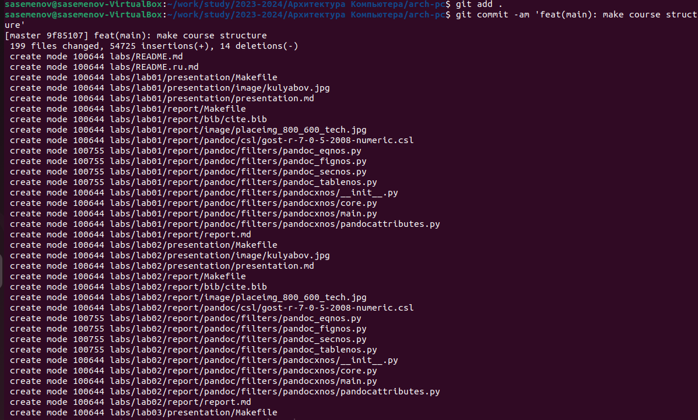

---
## Front matter
title: "Лабораторная работа №2"
subtitle: "Система контроля версий GIT"
author: "Семенов Сергей Алексеевич"

## Generic otions
lang: ru-RU
toc-title: "Содержание"

## Bibliography
bibliography: bib/cite.bib
csl: pandoc/csl/gost-r-7-0-5-2008-numeric.csl

## Pdf output format
toc: true # Table of contents
toc-depth: 2
lof: true # List of figures
fontsize: 12pt
linestretch: 1.5
papersize: a4
documentclass: scrreprt
## I18n polyglossia
polyglossia-lang:
  name: russian
  options:
	- spelling=modern
	- babelshorthands=true
polyglossia-otherlangs:
  name: english
## I18n babel
babel-lang: russian
babel-otherlangs: english
## Fonts
mainfont: PT Serif
romanfont: PT Serif
sansfont: PT Sans
monofont: PT Mono
mainfontoptions: Ligatures=TeX
romanfontoptions: Ligatures=TeX
sansfontoptions: Ligatures=TeX,Scale=MatchLowercase
monofontoptions: Scale=MatchLowercase,Scale=0.9
## Biblatex
biblatex: true
biblio-style: "gost-numeric"
biblatexoptions:
  - parentracker=true
  - backend=biber
  - hyperref=auto
  - language=auto
  - autolang=other*
  - citestyle=gost-numeric
## Pandoc-crossref LaTeX customization
figureTitle: "Рис."
tableTitle: "Таблица"
listingTitle: "Листинг"
lofTitle: "Список иллюстраций"
lolTitle: "Листинги"
## Misc options
indent: true
header-includes:
  - \usepackage{indentfirst}
  - \usepackage{float} # keep figures where there are in the text
  - \floatplacement{figure}{H} # keep figures where there are in the text
---

# Цель работы
Целью работы является приобретение практических навыков по
работе в системе git.
# Выполнение лабораторной работы
1.Создание учетное записи на github.com

Создаем предварительную конфигурацию git.

Создание рабочего пространства и репозитория курса на основе
шаблона.
Откройте терминал и создайте каталог для предмета “Архитектура
компьютера”

Создание репозитория курса на основе шаблона.
Репозиторий на основе шаблона можно создать через web-интерфейс
github.
Перейдем на страницу репозитория с шаблонами курса
https://github.com/yamadharma/cour se-
directory-student-template. Далее выберите use
this template

В открывшемся окне задайте имя репозитория (Repository
name) study_2023–2024_arhpc и создайте репозиторий
(кнопка Create repository from template). Откройте
терминал и перейдите в каталог курса:

# Выводы
В ходе выполнения лабораторной работы мы приобрели практические навыки по работе в системе git.
