---
## Front matter
title: "Лабораторная работа №3"
subtitle: "Простейший вариант"
author: "Семенов Сергей Алексеевич"

## Generic otions
lang: ru-RU
toc-title: "Содержание"

## Bibliography
bibliography: bib/cite.bib
csl: pandoc/csl/gost-r-7-0-5-2008-numeric.csl

## Pdf output format
toc: true # Table of contents
toc-depth: 2
lof: true # List of figures
lot: true # List of tables
fontsize: 12pt
linestretch: 1.5
papersize: a4
documentclass: scrreprt
## I18n polyglossia
polyglossia-lang:
  name: russian
  options:
	- spelling=modern
	- babelshorthands=true
polyglossia-otherlangs:
  name: english
## I18n babel
babel-lang: russian
babel-otherlangs: english
## Fonts
mainfont: PT Serif
romanfont: PT Serif
sansfont: PT Sans
monofont: PT Mono
mainfontoptions: Ligatures=TeX
romanfontoptions: Ligatures=TeX
sansfontoptions: Ligatures=TeX,Scale=MatchLowercase
monofontoptions: Scale=MatchLowercase,Scale=0.9
## Biblatex
biblatex: true
biblio-style: "gost-numeric"
biblatexoptions:
  - parentracker=true
  - backend=biber
  - hyperref=auto
  - language=auto
  - autolang=other*
  - citestyle=gost-numeric
## Pandoc-crossref LaTeX customization
figureTitle: "Рис."
tableTitle: "Таблица"
listingTitle: "Листинг"
lofTitle: "Список иллюстраций"
lotTitle: "Список таблиц"
lolTitle: "Листинги"
## Misc options
indent: true
header-includes:
  - \usepackage{indentfirst}
  - \usepackage{float} # keep figures where there are in the text
  - \floatplacement{figure}{H} # keep figures where there are in the text
---

# Цель работы
Целью работы является освоение процедуры оформления отчетов с помощью легковесного 
языка разметки Markdown.
# Выполнение лабораторной работы
1.Откройте терминал

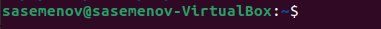

2.Перейдите в каталог курса сформированный при выполнении лабораторной работы номер 2

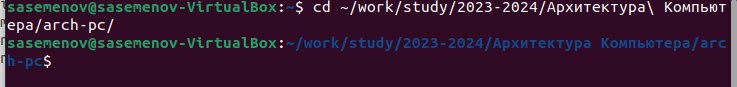

Обновите локальный репозиторий,скачав изменения из удаленного репозитория с помощью команды git pull

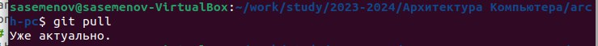

3.Перейдите в каталог с шаблонами отчета по лабораторной работы номер 3

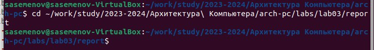

4.Проведите компиляцию шаблона с использованием Makelife.Для этого введите команду make

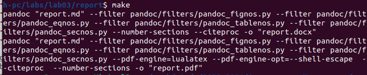

При успешной компиляции должны сгенерироваться файлы report.pdf и report.docx.Откройте и проверьте корректность полученных файлов

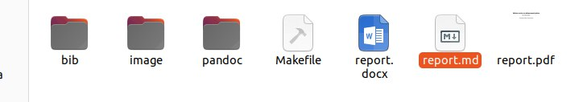

5.Удалите полученные файлы с использованием Makelife.Для этого введите команду make clean

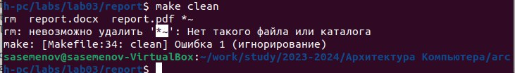

Проверьте,что после этой команды файлы report.pdf и report.docx были удалены.

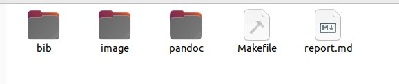

6.Откройте файл report.md

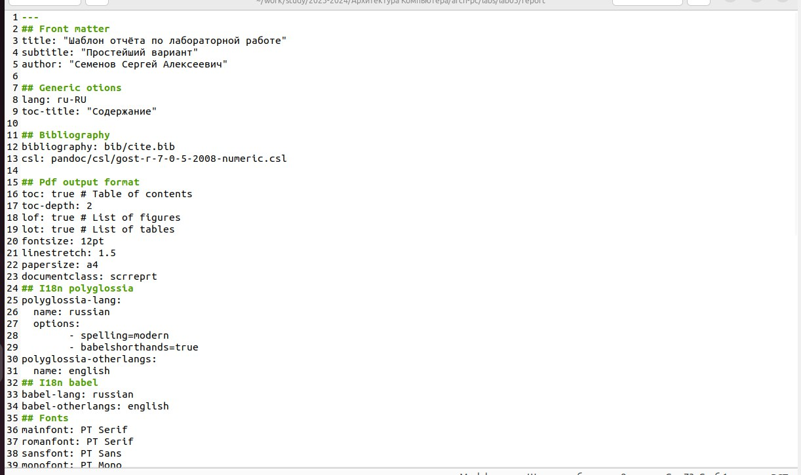

7.Отчет

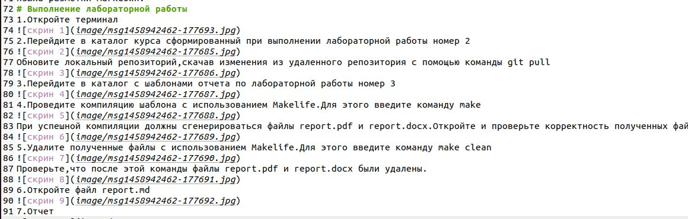

8.Загрузить на Github.

8.1

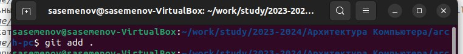

8.2

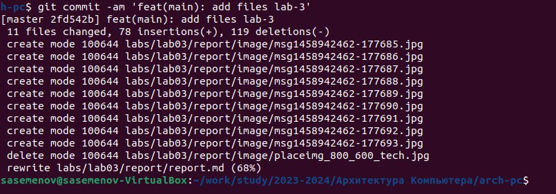

8.3

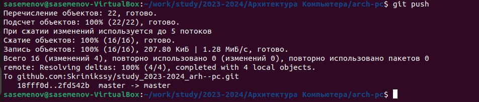

# Выводы
В ходе выполнения лабораторной работы мы научились использовать язык разметки markdown 
