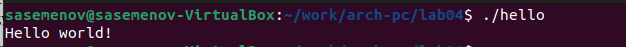

---
## Front matter
title: "Лабораторная работа №4"
subtitle: "Cоздание и процесс обработки программ на языке ассемблера NASM"
author: "Семенов Сергей Алексеевич"

## Generic otions
lang: ru-RU
toc-title: "Содержание"

## Bibliography
bibliography: bib/cite.bib
csl: pandoc/csl/gost-r-7-0-5-2008-numeric.csl

## Pdf output format
toc: true # Table of contents
toc-depth: 2
lof: true # List of figures
lot: true # List of tables
fontsize: 12pt
linestretch: 1.5
papersize: a4
documentclass: scrreprt
## I18n polyglossia
polyglossia-lang:
  name: russian
  options:
	- spelling=modern
	- babelshorthands=true
polyglossia-otherlangs:
  name: english
## I18n babel
babel-lang: russian
babel-otherlangs: english
## Fonts
mainfont: PT Serif
romanfont: PT Serif
sansfont: PT Sans
monofont: PT Mono
mainfontoptions: Ligatures=TeX
romanfontoptions: Ligatures=TeX
sansfontoptions: Ligatures=TeX,Scale=MatchLowercase
monofontoptions: Scale=MatchLowercase,Scale=0.9
## Biblatex
biblatex: true
biblio-style: "gost-numeric"
biblatexoptions:
  - parentracker=true
  - backend=biber
  - hyperref=auto
  - language=auto
  - autolang=other*
  - citestyle=gost-numeric
## Pandoc-crossref LaTeX customization
figureTitle: "Рис."
tableTitle: "Таблица"
listingTitle: "Листинг"
lofTitle: "Список иллюстраций"
lotTitle: "Список таблиц"
lolTitle: "Листинги"
## Misc options
indent: true
header-includes:
  - \usepackage{indentfirst}
  - \usepackage{float} # keep figures where there are in the text
  - \floatplacement{figure}{H} # keep figures where there are in the text
---

# Цель работы
Целью работы является освоение процедуры компиляции и сборки программ, написанных на ассемблере NASM.
# Выполнение лабораторной работы
Создадим каталог для работы с программами на языке ассемблера NASM

Перейдём в созданный каталог.

Создадим текстовый файл с именем hello.asm.

Откроем этот файл с помощью текстового редактора gedit и введём в него текст из лабораторной работы.

Для компиляции текста программы «Hello World» необходимо написать:

Проверим работу команды

Скомпилируем исходный файл hello.asm в obj.o.

С помощью команды ls проверим, что файлы были созданы.

Получим исполняемую программу и объектный файл. Для этого передадим на обработку компоновщику.

С помощью команды ls проверим, что исполняемый файл hello был создан.

Теперь выполним следующую команду:

С помощью команды ls выполним проверку.

Запустим на выполнение созданный исполняемый файл, находящийся в текущем каталоге.

В каталоге ~/work/arch-pc/lab04 с помощью команды cp создадим копию файла hello.asm с именем lab4.asm.

С помощью текстового редактора внесём изменения в текст программы в файле lab4.asm так, чтобы вместо Hello world! на экран выводилась строка с фамилией и именем.

Оттранслируем полученный текст программы lab4.asm в объектный файл. Выполним компоновку объектного файла и запустим получившийся исполняемый файл.

# Выводы
В ходе выполнения лабораторной работы мы освоели процедуры компиляции и сборки программ, написанных на ассемблере NASM.
